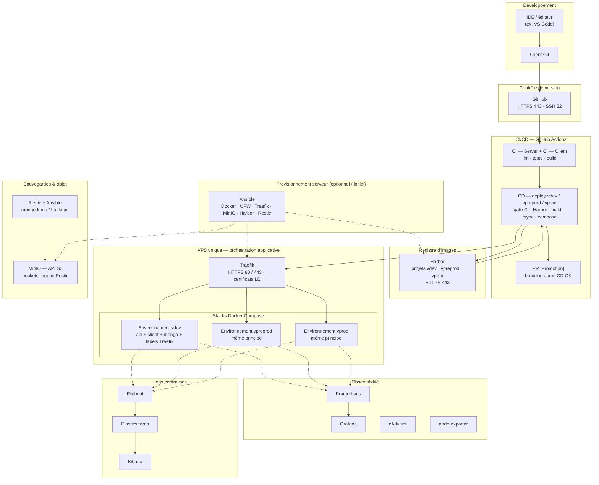
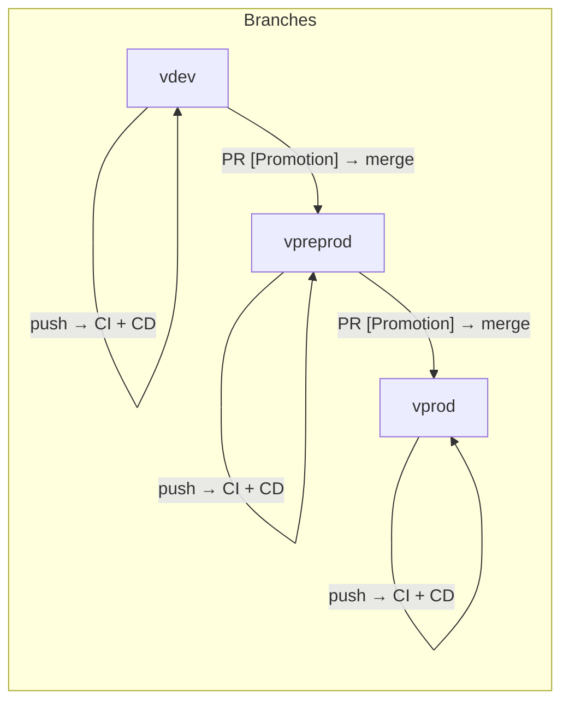
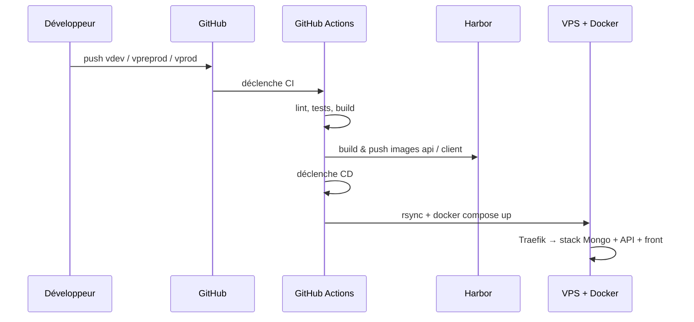

# Diagramme de workflow DevOps — Thé Tip Top

> Document de synthèse visuelle, sur le modèle d’un schéma « infrastructure globale » (développeurs → Git → CI/CD → registre → environnements → observabilité → sauvegardes).  
> **Aligné sur ce dépôt** : monorepo **client React (Vite) + API Node (Express) + MongoDB**, déploiement sur **un VPS** via **Docker Compose** et **Traefik**, registre **Harbor**. Les trois environnements (**vdev**, **vpreprod**, **vprod**) sont des **stacks Compose distinctes** derrière Traefik — **pas de Kubernetes** dans l’implémentation actuelle (contrairement à certains schémas génériques préprod/prod « K8s »).

---

## 1. Vue macro (équivalent « blocs reliés »)

**Lecture rapide** : les développeurs poussent sur **GitHub** ; **GitHub Actions** exécute la **CI**, puis le **CD** construit et pousse les images vers **Harbor**, synchronise le dépôt sur le **VPS** et lance **docker compose**. **Traefik** route le trafic HTTPS vers les bons conteneurs par environnement. **Prometheus / Grafana** et la stack **ELK** complètent l’exploitation ; **Restic** envoie les sauvegardes vers des buckets **MinIO**.

---

## 2. Flux Git & branches (workflow promotion)

- Chaque **push** sur une branche d’environnement déclenche **CI** puis **CD** correspondant.  
- Après un **CD réussi** sur `vdev` ou `vpreprod`, une **PR de promotion** (souvent en brouillon) peut être créée automatiquement pour proposer le merge vers l’étape suivante.  
- Détail : `.github/ARCHITECTURE_CI_CD.md`, `docs/RAPPORT_INFRA_ET_PROJET.md`.

---

## 3. Séquence simplifiée « un déploiement »

---

## 4. Correspondance avec un schéma « Kubernetes préprod / prod »

| Élément souvent vu sur des schémas génériques | Dans **ce** projet |
|-----------------------------------------------|---------------------|
| Orchestrateur **Kubernetes** préprod / prod | **Docker Compose** sur un **seul VPS** ; isolation par **projet Harbor** et **stack Compose** + préfixes / labels Traefik |
| **Docker Hub** | **Harbor** (registry privée) |
| Ingress | **Traefik** (fichiers dynamiques + labels Compose) |
| Namespaces | **Réseaux / stacks** Compose distinctes par environnement |

---

## 5. Ports et accès (rappel)

| Zone | Protocole / ports typiques |
|------|----------------------------|
| GitHub | **443** (HTTPS), **22** (SSH) |
| Harbor / UI | **443** (HTTPS), selon `HARBOR_REGISTRY_BASE` |
| Applications vdev / vpreprod / vprod | **443** (HTTPS) via Traefik |
| Grafana / Prometheus / Kibana | Routage **Traefik** vers les stacks monitoring / logging (voir `infra/vps/traefik/dynamic/`) |
| MinIO | API S3 + console — routage dédié Traefik |

---

## 6. Fichiers utiles pour détailler le schéma

| Sujet | Emplacement |
|-------|-------------|
| Rapport infra & projet | `docs/RAPPORT_INFRA_ET_PROJET.md` |
| CI/CD | `.github/ARCHITECTURE_CI_CD.md`, `.github/workflows/` |
| Stack déployée | `infra/deploy/docker-compose.stack.yml`, `infra/deploy/env/*.env.example` |
| Traefik | `infra/vps/traefik/dynamic/` |
| Ansible | `infra/ansible/` |

---

*Document généré pour soutenance / documentation d’équipe — à mettre à jour si l’architecture évolue.*
