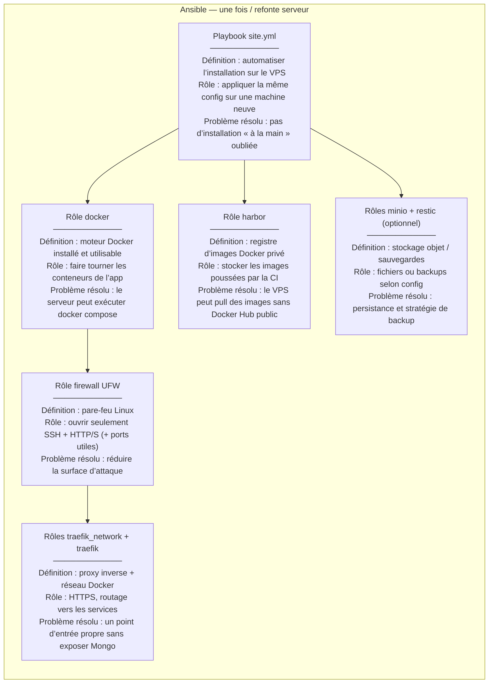
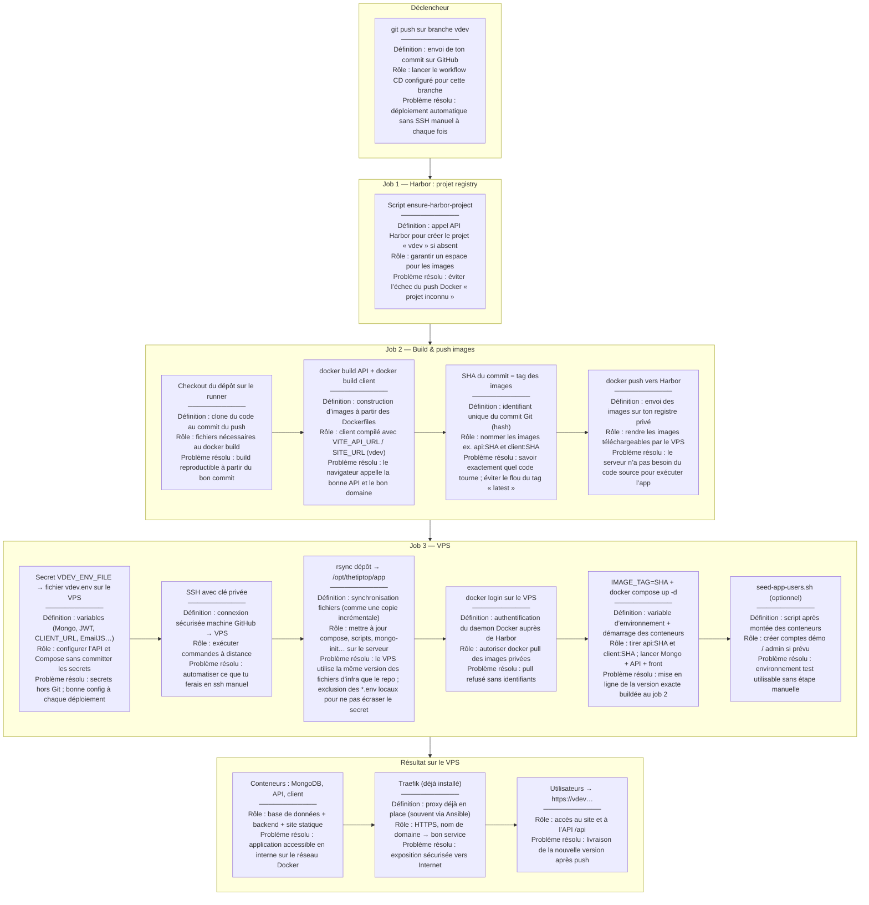

# Schéma du déploiement (push → production) — éléments expliqués

Ce document décrit le flux **branche `vdev`** (même logique pour `vpreprod` / `vprod` avec d’autres noms de secrets et URLs). Chaque bloc du schéma indique **ce que c’est**, **à quoi ça sert** et **quel problème ça règle**.

---

## 1. Provisionnement initial (hors push) — Ansible

Exécuté **manuellement** (`ansible-playbook`), pas à chaque `git push`.

---

## 2. À chaque push sur `vdev` — GitHub Actions

---

## 3. Chaîne causale (résumé)

| Élément | En une phrase |
|--------|----------------|
| **SHA** | Étiquette unique du commit ; même valeur pour les tags d’images et pour `IMAGE_TAG`, pour déployer **la même** version partout. |
| **Harbor** | Registre qui **stocke** les images ; le VPS **pull** ce que la CI a **push**. |
| **Rsync** | Met le **code d’infra** (compose, scripts) sur le serveur **aligné** sur le dépôt, **sans** remplacer le `vdev.env` venant des secrets. |
| **vdev.env (secret)** | Donne les **variables secrètes** au conteneur API / compose ; sans ça, mauvaise config ou panne. |
| **Ansible** | Prépare la **machine** (Docker, Traefik, Harbor…) ; le **push** ne remplace pas cette étape. |

Tu peux coller les blocs `mermaid` sur [mermaid.live](https://mermaid.live) pour exporter en **SVG** ou **PNG** pour un rapport.
